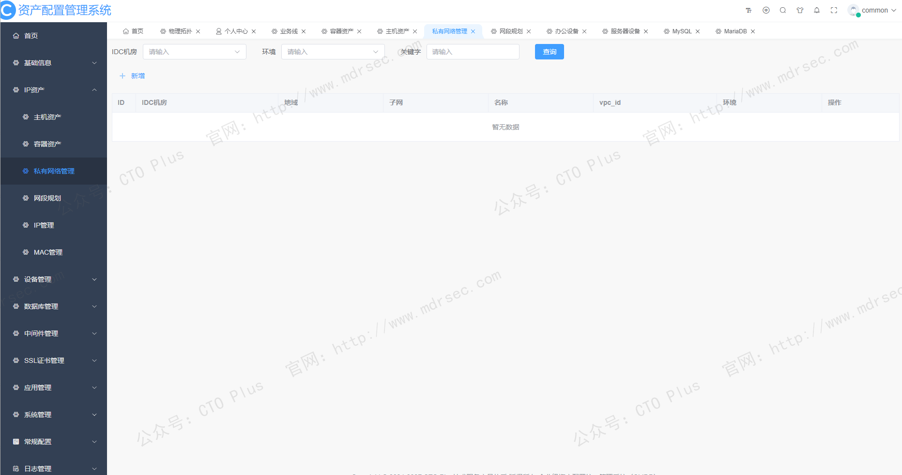
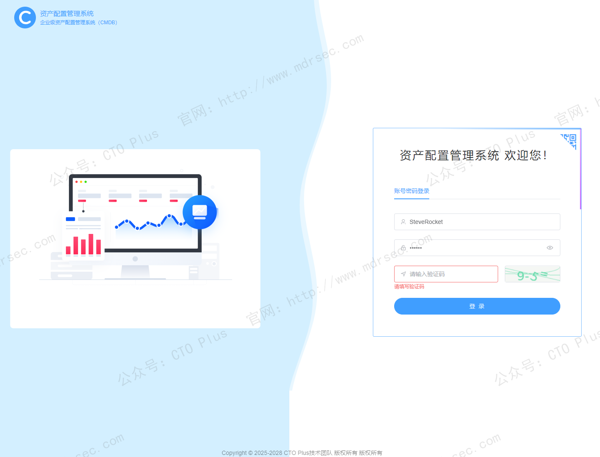
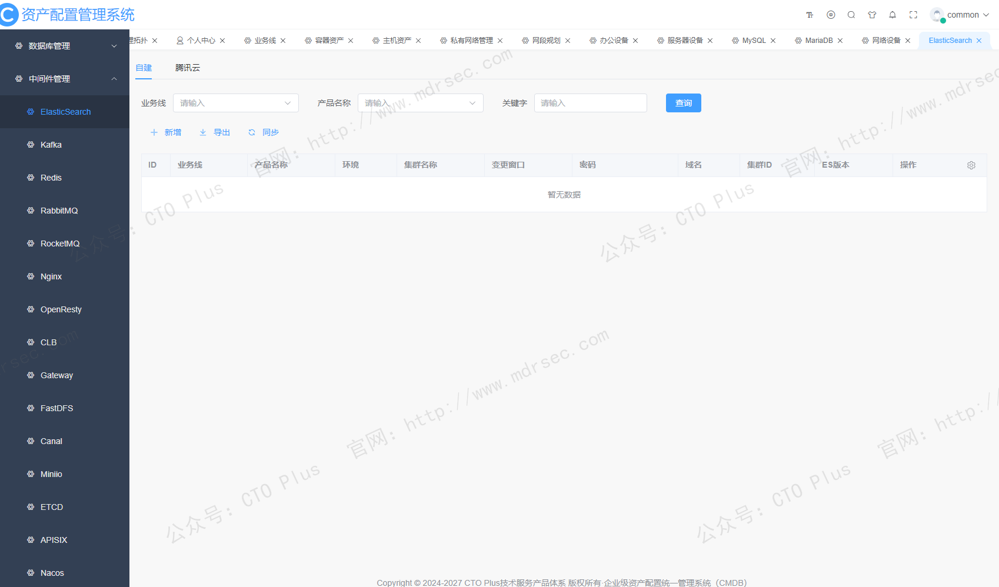
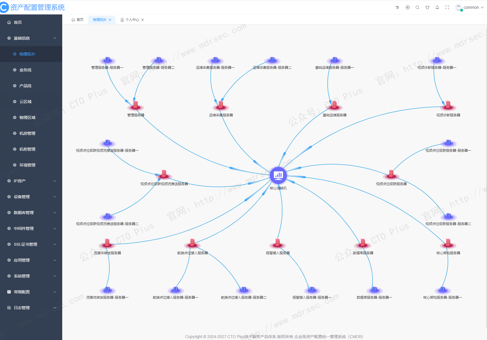
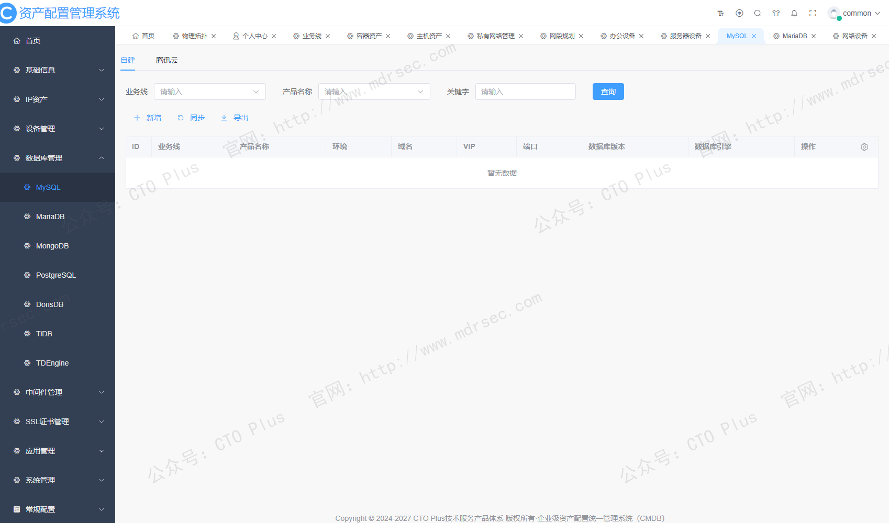
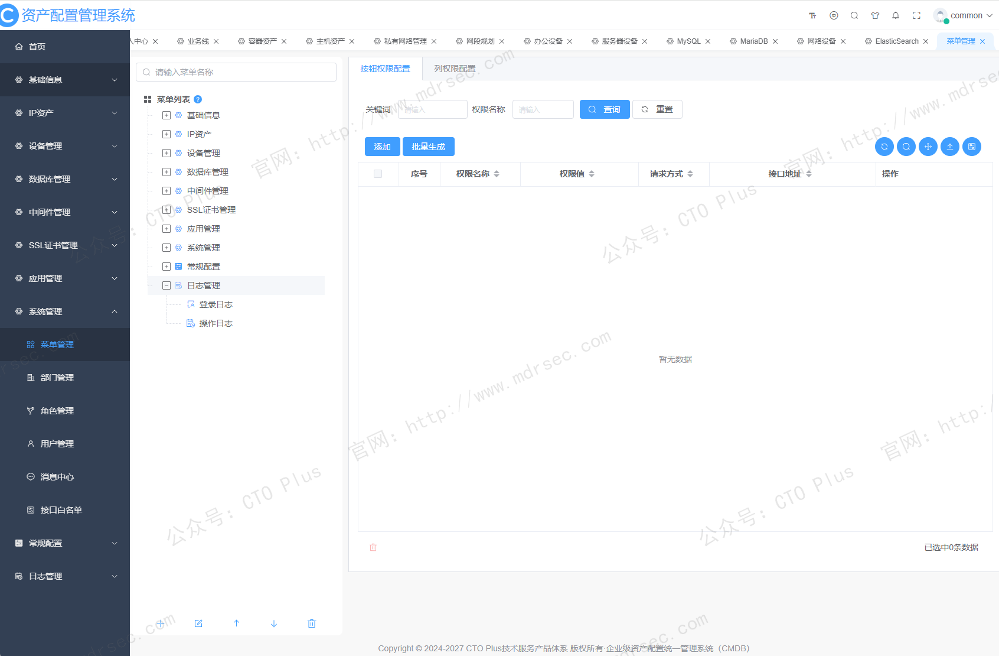
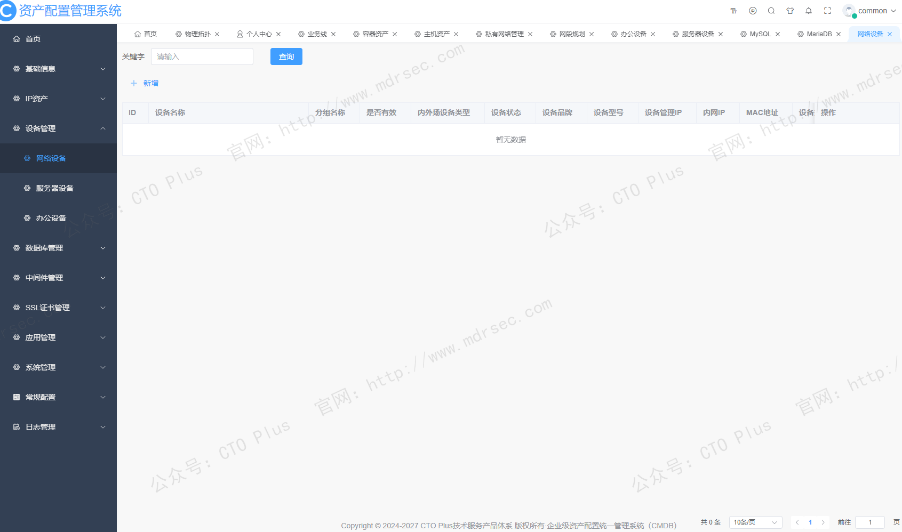

# 资产配置管理系统（CMDB）

## 关于我们

- 官网： http://www.mdrsec.com

我们的技术文章和产品概述欢迎浏览我们的门户。

- 公众号：CTO Plus

最新的动态欢迎关注我们官方唯一公众号。

- 作者QQ

更详细更具体的需求，或者项目合作，或者问题 欢迎联系我。

- QQ群

我们官方组建的QQ群，如果您有兴趣也可以加入我们。

- 请喝咖啡

如果感兴趣，也可以请我喝杯咖啡

## 产品核心功能模块

随着混合云、容器、微服务等技术的普及，IT环境变得前所未有的复杂和动态。如何有效管理这纷繁复杂的“数字王国”？我们通过自研了**配置管理数据库（Configuration Management Database，CMDB）** 来高效解决这一问题。我们的CMDB并非一个简单的资产清单，而是企业IT运维的“数字大脑”和“信任基础”。

**CMDB是一个逻辑数据库，用于存储和管理企业IT环境中所有配置项（Configuration Items, CIs）及其相互关系的全生命周期信息**。配置项可以涵盖任何需要管理的组件，包括但不限于服务器、网络设备、软件应用、数据库、中间件、容器集群，甚至包括文档、人员和服务。

**CMDB与IT资产管理（ITAM）的区别**：
*   **IT资产管理**侧重于财务和生命周期管理，追踪资产的购买价格、折旧、所属部门和位置等会计核算信息。
*   **CMDB**则超越资产管理，它聚焦于技术层面的关联关系。例如，CMDB不仅会记录一台服务器的CPU和内存配置（资产属性），还会记录这台服务器上运行了哪些关键应用、连接了哪些数据库、以及这些服务支撑了哪些业务线（配置关系）。

简而言之，**资产管理回答“我们有什么”，而CMDB回答“这些东西之间如何关联，以及它们如何影响业务”**。

我们运维部门结合自身业务情况自研了一套CMDB系统，接下来为大家介绍下我们CMDB的核心功能模块

### CMDB的核心技术架构与能力

我们CMDB系统并非单一数据库，而是由采集、治理、存储、消费等多个模块构成的复杂体系，其技术架构通常可分为以下几层：

1.  **数据采集层（数据输入）**：这是CMDB的“神经末梢”，负责获取数据。核心手段包括：
    *   **自动化发现**：通过网络扫描、API集成等方式，自动识别网络中的设备、软件及其配置信息，大幅减少人工录入。
    *   **集成与同步**：与ITSM、监控系统、云平台（如AWS、Azure）等对接，实现数据的自动同步和更新。
2.  **数据治理与建模层（核心逻辑）**：这是CMDB的“大脑”，负责处理原始数据。
    *   **数据标准化与调和**：将从多个数据源收集的数据进行清洗、去重和整合，确保CMDB作为“单一真实数据源”的可信度。
    *   **模型设计**：这是CMDB建设的核心。它定义了CI的类型、属性以及它们之间的标准关系（如“依赖”、“连接”、“运行于”）。设计应遵循**“最小化原则”**和**“消费场景导向原则”**，即只管理对运维业务有价值的核心数据，避免贪大求全导致维护成本失控。
3.  **数据消费与展示层**：将数据价值传递给最终用户。
    *   **可视化与服务映射**：通过拓扑图等形式直观展示CI间的复杂关系，形成“IT数字地图”，帮助团队快速理解服务依赖。
    *   **开放API**：将配置数据提供给变更管理、事件管理、自动化运维等下游系统使用，是运维工具体系的基础。

### CMDB的业务价值与应用场景

我们CMDB的价值在于它将孤立的IT数据转化为支撑业务决策和高效运维的洞察力，主要体现在以下几个核心场景：

1.  **变革管理：从“猜测”到“可预见”**
    CMDB最核心的价值在于**变更影响分析**。当计划对某台服务器或网络设备进行变更时，管理员可以立即通过CMDB的可视化关系图，看到将有多少个应用、多少条业务线会因此受影响。这从根本上减少了因变更计划不周导致的服务中断。

2.  **事件与问题管理：加速故障定位（MTTR）**
    当服务出现故障时，CMDB帮助团队快速理清头绪。例如，邮件系统宕机，技术人员通过CMDB可以迅速定位到其依赖的邮件服务器、网关和存储设备，检查近期是否有相关变更，从而大幅缩短平均修复时间（MTTR），将被动救火变为主动排雷。

3.  **合规与审计：提供可信的证据链**
    CMDB维护了CI及其变更的完整历史记录，能够轻松回答“谁、在什么时候、出于什么原因、更改了什么配置”这类问题。这对于满足GDPR、HIPAA等日趋严格的法规要求至关重要。

4.  **从成本中心到价值中心：FinOps与容量规划**
    随着云计算的普及，IT成本的可视化成为焦点。结合“服务树”等模型，CMDB可以将底层资源（如云主机费用）清晰地分摊到各个业务线和产品上，为成本优化提供精确数据基础。同时，它也能分析资源利用率，为容量规划提供决策依据。

### 实施注意项

尽管CMDB价值巨大，但行业统计显示，仅有约25%的组织从其CMDB投资中获得了有意义的价值。高失败率主要源于对CMDB的认知偏差和实施策略失误。要成功实施，需遵循以下最佳实践：

1.  **明确建设愿景，从小处着手**
    将CMDB视为一个持续演进的过程，而非一次性项目。应从**关键业务服务**出发，定义优先级。例如，先为核心交易系统的约200个关键CI建立模型和关系，再逐步扩展范围，而不是试图在第一天就管理所有资产，包括鼠标、显示器和每根网线。

2.  **数据质量优先于数量**
    **“垃圾进，垃圾出”**是CMDB失败的主因。必须建立数据治理机制，明确每个CI的负责人，并利用自动化发现工具（能提升准确率至90%以上）来支撑数据更新，避免依赖人工维护。

3.  **以消费为导向，与流程深度融合**
    CMDB不能是一个孤立的“花瓶”。必须将其嵌入到变更管理、事件管理等核心ITSM流程中，作为标准动作的一环。例如，规定所有变更请求在执行前，必须附上CMDB生成的影响分析报告。当CMDB被“使用”起来，其数据才会被重视和维护。

4.  **正视现代IT环境的挑战**
    在2026年的今天，企业IT架构多是混合云和云原生环境。选型时，必须关注CMDB对容器、微服务、无服务器架构等动态资源的**自动化采集能力**和**实时同步能力**，这是保障其数据时效性和生命力的基础。

CMDB远不止是一个技术工具，它更是一项关乎IT治理和运营文化的长期战略。成功的CMDB建设，能够将一盘散沙的IT组件凝聚成一张清晰、动态、可信的业务服务网络地图，最终使IT部门从成本中心转型为驱动业务稳健增长的赋能者。

如有需求和问题欢迎联系我们咨询。

## 产品清单

### 企业网络安全运营中心产品

- 资产安全配置管理系统（SCMDB）
- 终端侦测与响应系统（EDR）
- 网络侦测与响应系统（NDR）
- 企业网络资产攻击面管理系统（CAASM）
- 资产暴露面管理系统（AEMS）
- 网络安全蜜罐管理系统（HoneyPot）
- 安全事件收集与告警管理系统（SIEM）
- 扩展侦测与响应系统（XDR）
- 多引擎脆弱性扫描系统（VAS）
- 多源日志审计监测系统（LAS）
- 网络安全威胁情报中心（TIS）
- 网络安全漏洞库管理系统（VDBS）
- 网络安全编排与自动化响应（SOAR）
- 威胁狩猎系统（THS）
- 数据库安全审计系统（DSAS）
- AI智能体安全态势管理系统（AISPM）
- Web防火墙（WAF）
- 网站安全监测平台（WSM）
- 网络安全态势感知平台（SSAP）
- 网络安全自动化应急响应工具系统（NSRT）
- 企业网络安全运维工具系统（SecTools）
- 网络安全自动化等保测评系统（ASES）
- 浏览器安全监测防护系统（BSMPS）
- 网络安全用户实体行为分析系统（UEBA）
- 互联网电信诈骗预警防护系统（TPFWS）
- 云原生安全管理平台（CNAPP）
- 自动化渗透测试系统（PTS）
- 工业企业信息安全监测中心（IoT SOC）
- 企业智能安全运营中心（AISOC）

### 企业自动化运维产品

- 资产配置管理系统（CMDB）
- 运维智能监控告警管理平台（AIMAMS）
- 企业网络工具系统（NTools）
- 自动化测试系统（AutoTest）
- 自动化运维系统（AutoOps）
- 企业运维工具系统（OpsTools）
- 物联网管理系统（IoTS）
- 软件开发生命周期管理系统（SDLC）
- IT流程管理系统（ITSM）

### 企业数字化运营资源管理系统产品

- 制造执行管理系统（MES）
- 运输管理系统（TMS）
- 跨境电商企业资源管理系统（ERP）
- 企业客户关系管理系统（CRM）
- 跨境电商仓库管理系统（WMS）
- 财务管理系统（FMS）
- 质量管理系统（QMS）
- 精准营销管理系统（PMS）
- 智能生产管理系统（SPMS）
- 电商BI系统（BI）
- 智能互联网分布式爬虫系统（AISpider）
